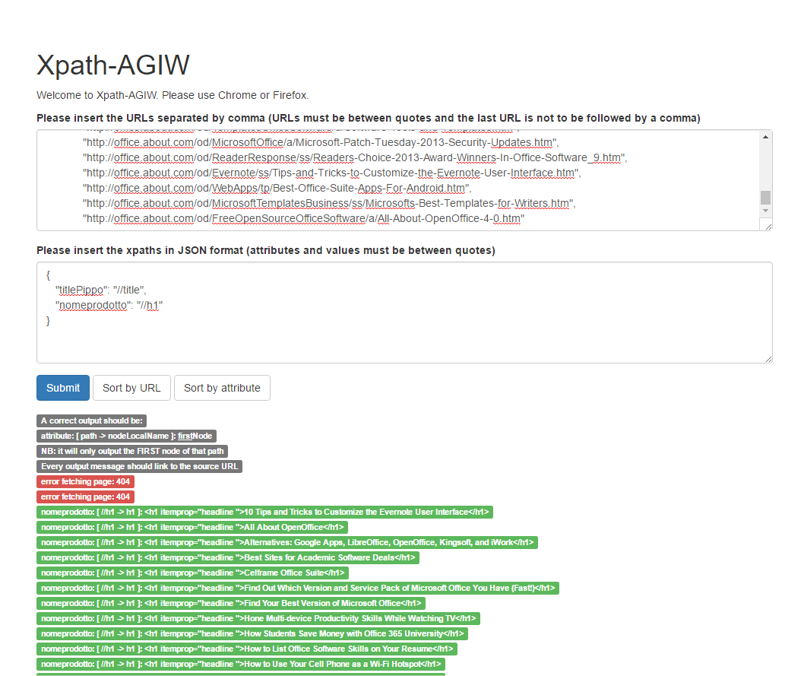

# Xpath-AGIW
Node.js and Angular.js application for the first AGIW project. 

To install it, simply clone the repository and run the following commands in the directory: 
```
npm install
npm start
```
Then go to [localhost:3000](http://localhost:3000/)

Requires Node.js.

#### Screenshots
